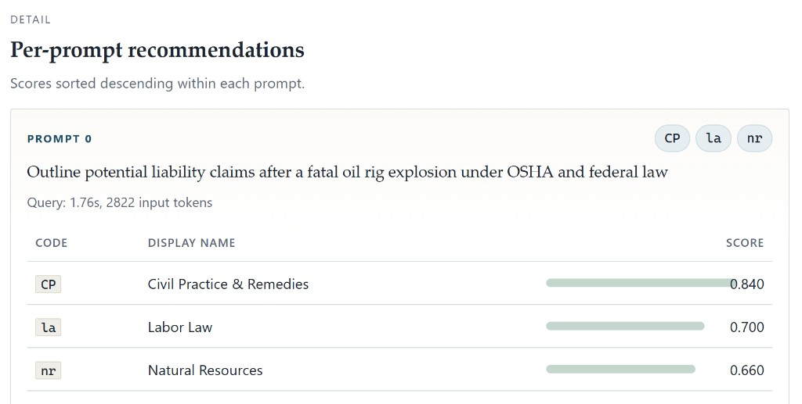

# Classifier: OpenRouter + TypeSafe Jev

Bare-bones Python demo that uses **[TypeSafe Jev](https://openrouter.ai/~typesafe/jev-latest)** ([@typesafeai](https://x.com/typesafeai)) through the **OpenRouter Decisions API** to recommend which Texas statute databases should be searched for a legal research prompt.

This is a multi-label **classifier**, not a chat bot. Jev does not generate prose. It answers typed questions about a `state` and returns calibrated probabilities.

Live chatbot that motivates this pattern: [aifab-law-tx.streamlit.app](https://aifab-law-tx.streamlit.app)

The statute databases in `databases.json` are similar to those used in the live app at [law-tx.aifab.xyz](https://law-tx.aifab.xyz/).



## What a `noul` is

A **noul** is Jev's yes/no question type. You supply instructions (a question or a statement). Jev returns a probability from **0 to 1** for "yes" / "this holds".

For database routing we ask **one noul per database**, then keep codes where `noul >= 0.5` (with a top-k fallback if none clear the bar).

## Setup

```bash
cd classifier
python -m venv .venv

# Windows
.venv\Scripts\activate
# macOS / Linux
# source .venv/bin/activate

pip install -r requirements.txt
```

Get an API key from [OpenRouter](https://openrouter.ai/keys), then:

```bash
# Windows (cmd)
set OPENROUTER_API_KEY=sk-or-v1-...

# Windows (PowerShell)
$env:OPENROUTER_API_KEY="sk-or-v1-..."

# macOS / Linux
export OPENROUTER_API_KEY=sk-or-v1-...
```

## Quick start

Classify the sample prompts against `databases.json`:

```bash
python choose_db.py
```

That writes `db_recommendations.json`.

Render reports:

```bash
python report_db_recommendations.py
python write_html_report.py
```

Open `db_recommendations_report.md` or `index.html`.

### Useful flags

```bash
python choose_db.py --prompts prompts.csv --databases databases.json --out db_recommendations.json --threshold 0.5 --top-k 3
python report_db_recommendations.py --json db_recommendations.json --out db_recommendations_report.md
python write_html_report.py --json db_recommendations.json --out index.html
```

## Library-style usage

```python
from choose_db import classify_prompt, load_databases, get_api_key

databases = load_databases("databases.json")
result = classify_prompt(
    "Draft a Texas mineral rights lease template",
    databases,
    api_key=get_api_key(),  # or pass a string
)
print(result["recommended_databases"])
print(result["scores"])
```

## How it works

1. Load prompts from `prompts.csv` (subset of real legal research prompts).
2. Load the database catalog from `databases.json` (`code`, `name`, `description`).
3. For each prompt, build Decisions API `state` (prompt + short catalog) and one `noul` question per DB.
4. `POST https://openrouter.ai/api/alpha/decisions` with model `~typesafe/jev-latest`.
5. Threshold / top-k → JSON → markdown / HTML reports.

Core call shape:

```python
payload = {
    "model": "~typesafe/jev-latest",
    "state": {"prompt": "...", "available_databases": ["- nr (Natural Resources): ..."]},
    "questions": {
        "nr": {
            "type": "noul",
            "instructions": "This Texas legal research prompt should search the Natural Resources database (...).",
        },
        # one entry per database code
    },
}
```

## Repo layout

| Path | Role |
| --- | --- |
| `choose_db.py` | Classifier + CLI (`classify_prompt`, batch runner) |
| `databases.json` | Statute shard codes, names, descriptions |
| `prompts.csv` | Sample research prompts |
| `report_common.py` | Shared JSON validation / ranking helpers |
| `report_db_recommendations.py` | Markdown report |
| `write_html_report.py` | Single-file HTML report |
| `requirements.txt` | Python dependencies |
| `.env.example` | API key placeholder |
| `LICENSE` | WTFPL |
| `db_recommendations.json` | Sample classifier output (from `choose_db.py`) |
| `db_recommendations_report.md` | Sample markdown report |
| `index.html` | Sample HTML report |
| `assets/per-prompt-recommendations.png` | Screenshot of per-prompt scores |

## Notes

- Requires network access to OpenRouter.
- Sample prompts and database descriptions are illustrative Texas-law catalog entries for the demo (similar to [law-tx.aifab.xyz](https://law-tx.aifab.xyz/)).
- HTML report intentionally omits per-token price rates; token counts and wall-clock time are still shown when present in the JSON.

## License

[Do What The Fuck You Want To Public License](http://www.wtfpl.net/) (WTFPL)
